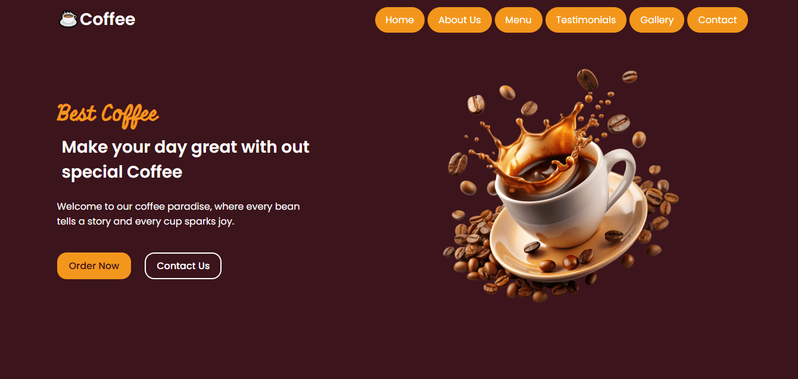
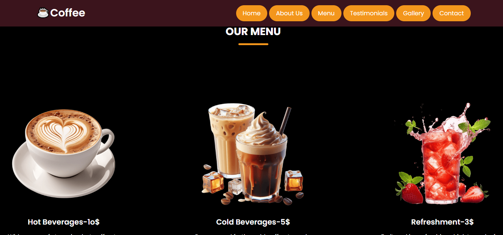
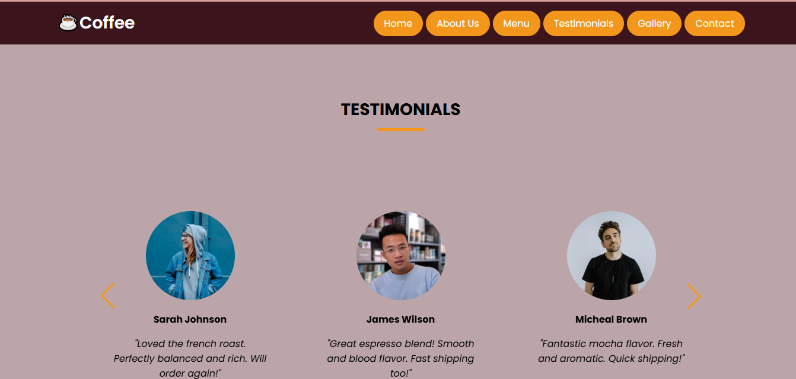
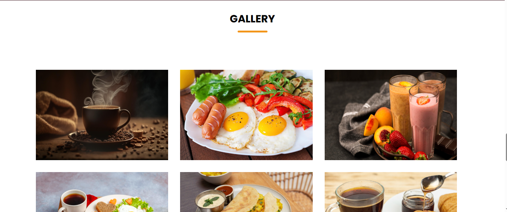
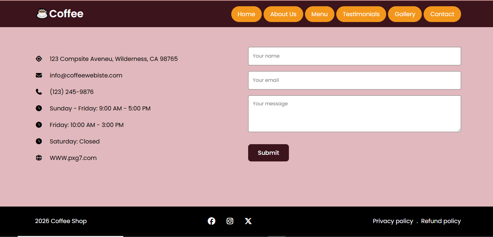

##Coffee Website

##About my project
This is responsive coffee website made by using HTML,CSS, and Javascript. It includes multiple sections like Home,About,Menu,Testimonials,Gallery and Contact.

##Languages Used
-HTML
-CSS
-JavaScript

##Screenshot

.png)

##Live Demo
 https://pxg7.github.io/COFFE-WEBSITE/

##My Current Goals
-Improve frontend development skills
-Learn advanced JavaScript
-Build more real-world projects
-Create better and cleaner UI designs

##Structure
Coffee-Website
│
├── index.html
├── style.css
├── script.js
│
└── assets/
    └── images/

